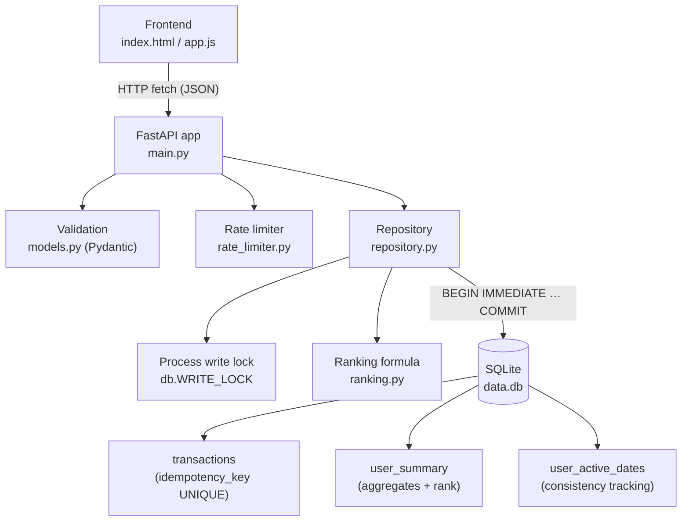
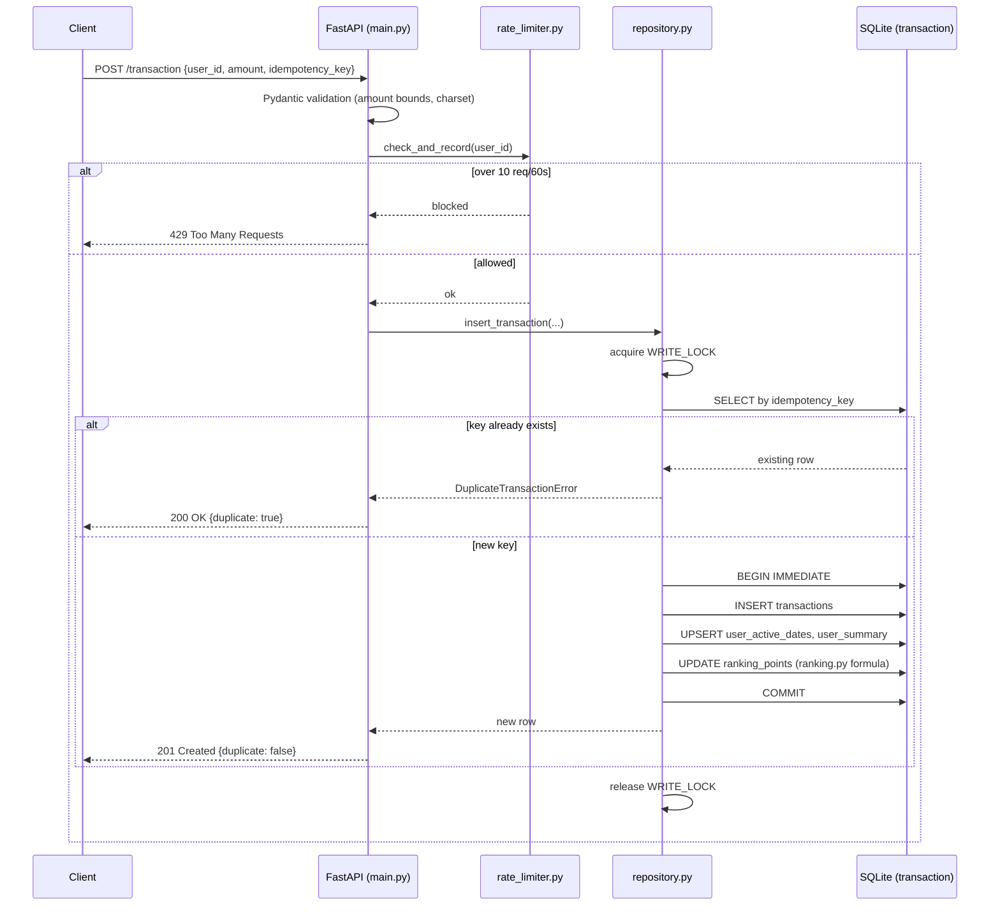

# Ranking Service

A small backend + frontend that records user "transactions" (point-earning
events), exposes a per-user summary, and ranks users on a leaderboard using
more than one factor — built to demonstrate API design, data consistency,
duplicate-request handling, concurrency safety, and abuse-resistant ranking.

```
ranking-service/
├── backend/            FastAPI service (Python)
│   ├── app/
│   │   ├── main.py         API routes, error handling
│   │   ├── repository.py   transaction insert + aggregate update (atomic)
│   │   ├── ranking.py       ranking score formula
│   │   ├── rate_limiter.py  per-user sliding-window rate limit
│   │   ├── db.py            SQLite connection, schema, locking
│   │   ├── models.py        request/response validation (Pydantic)
│   │   └── config.py        all tunable constants in one place
│   ├── tests/test_api.py    pytest suite (incl. a concurrency race test)
│   ├── requirements.txt
│   ├── Dockerfile
│   └── render.yaml          one-click-ish deploy config for Render
└── frontend/            Static vanilla HTML/CSS/JS client
    ├── index.html
    ├── style.css
    └── app.js
```

## 1. Architecture & data flow

**Components**



**Request flow for `POST /transaction`** — this is where validation, rate
limiting, idempotency, and atomic consistency all happen, in order:



`GET /summary/:userId` and `GET /ranking` are plain reads straight off
`user_summary` — no lock needed, since SQLite's WAL mode lets reads proceed
without blocking on the writer.

## 2. How to run it locally

**Backend**

```bash
cd ranking-service/backend
python -m venv .venv
source .venv/Scripts/activate      # Windows Git Bash
# .venv\Scripts\Activate.ps1       # Windows PowerShell
# source .venv/bin/activate        # macOS / Linux

pip install -r requirements.txt
uvicorn app.main:app --reload --port 8000
```

The API is now at `http://localhost:8000` (interactive docs at
`http://localhost:8000/docs`). A SQLite file `backend/data.db` is created
automatically on first run.

**Run the tests**

```bash
cd ranking-service/backend
python -m pytest tests/ -v
```

**Frontend**

The frontend is plain static files — no build step. Either:
- Open `frontend/index.html` directly in a browser, or
- Serve it: `cd ranking-service/frontend && python -m http.server 5500`

On load, type the backend URL into the "API base URL" field at the top
(defaults to `http://localhost:8000`) and click **Save**. A green dot means
the API is reachable.

## 3. Live deployment

This repo is deploy-ready but was not deployed from this environment (no
hosting credentials available here). Two free options that work with the
files already in the repo:

**Backend → Render**
1. Push this repo to GitHub.
2. In Render: New → Blueprint → point at the repo → it picks up
   `backend/render.yaml` automatically (Docker build).
3. Note: Render's free web service disk is ephemeral — `data.db` resets on
   redeploy/restart. For a persistent demo, attach a Render Disk mounted at
   `/app` (Render dashboard → Disks), or swap SQLite for Render's free
   Postgres (the `repository.py`/`db.py` split keeps that change localized).

**Frontend → GitHub Pages / Netlify / Vercel**
1. Deploy the `frontend/` folder as a static site (any of the three works
   with zero config — it's just HTML/CSS/JS).
2. Open the deployed page, paste the Render backend URL into "API base URL",
   click Save.

CORS is already wide open (`allow_origins=["*"]`) in `main.py` specifically
so the frontend can live on a different domain than the API.

## 4. How each API works

### `POST /transaction`
Records a point-earning event for a user.

Request body:
```json
{ "user_id": "alice", "amount": 50, "idempotency_key": "alice-2026-06-23-001" }
```

- `user_id`: 1–64 chars, letters/digits/`-`/`_` only.
- `amount`: number, `0.01 <= amount <= 100000`. Rejected if missing,
  negative, zero, NaN/Infinity, non-numeric, or out of range.
- `idempotency_key`: client-supplied string (1–128 chars) that uniquely
  identifies *this* transaction attempt. The client should generate one
  per logical transaction and reuse the same key on retries (timeouts,
  network errors) — see §6.

Responses:
- `201 Created`, `{"duplicate": false, ...}` — first time this key was seen.
- `200 OK`, `{"duplicate": true, ...}` — key was already processed; the
  original transaction's data is returned unchanged. Not an error, not a
  re-processing.
- `422 Unprocessable Entity` — validation failure, body explains which field.
- `429 Too Many Requests` — that user exceeded the rate limit (see §6).

### `GET /summary/:userId`
```json
{
  "user_id": "alice",
  "total_points": 120.0,
  "transaction_count": 3,
  "active_days": 2,
  "ranking_points": 87.0,
  "rank": 4
}
```
- `total_points`: raw sum of all of that user's transaction amounts.
- `ranking_points`: the score actually used for the leaderboard (see §5) —
  not the same as `total_points` by design.
- `404 Not Found` if the user has no transactions yet (no implicit
  zero-record creation; a user only exists once they've transacted).

### `GET /ranking`
Returns the leaderboard ordered by `ranking_points` descending (ties broken
by `total_points`, then `user_id` for determinism). Supports
`?limit=` (default 100, max 500) and `?offset=` for pagination.
```json
[
  {"rank": 1, "user_id": "bob", "total_points": 300.0, "active_days": 1, "ranking_points": 213.0},
  {"rank": 2, "user_id": "alice", "total_points": 120.0, "active_days": 1, "ranking_points": 87.0}
]
```

## 5. How ranking is calculated

A pure sum of points is easy to game — one oversized or scripted
transaction can take #1 with zero sustained engagement. So the score
combines **two factors**:

```
ranking_points = 0.7 * capped_points  +  0.3 * (active_days * 10)
```

- **`capped_points`** — sum of the user's transaction amounts, but each
  *individual* transaction can contribute at most `5,000` points toward
  this sum (configurable: `MAX_RANKING_CONTRIBUTION_PER_TRANSACTION` in
  `config.py`). The user's true, uncapped total is still shown as
  `total_points` in `/summary` — only the *ranking* score is capped. This
  blunts a single whale transaction from dominating the board.
- **`active_days`** — number of distinct calendar days the user has at
  least one transaction on. Rewards consistent activity over a one-off
  spike, which is harder to fake than a single large number.

Weights (`0.7` / `0.3`) and the per-day bonus (`10` points/day) live in
`config.py` as named constants — no magic numbers buried in logic, and they
can be retuned without touching the calculation code.

**Assumption documented:** the assignment didn't specify a transaction
domain, so this models a generic "points/rewards" system — each transaction
is an amount of points a user earned. The same formula structure (raw value
+ consistency, with a per-event cap) generalizes to other domains (sales,
trades, contributions) by swapping what "amount" represents.

## 6. How duplicate requests and abuse are prevented

**Duplicate processing (idempotency):**
- Every `POST /transaction` requires a caller-supplied `idempotency_key`.
- `transactions.idempotency_key` has a `UNIQUE` constraint in SQLite.
- On insert, the code first checks for an existing row with that key; if
  found, it returns the *original* transaction with `duplicate: true`
  instead of inserting again or erroring.
- Race safety: if two requests with the same key arrive at virtually the
  same instant, both could pass the initial duplicate-check before either
  commits. That's covered two ways: (1) the whole check-then-insert
  sequence is wrapped in a process-wide `threading.Lock`
  (`db.WRITE_LOCK`) so only one request is actually inserting at a time,
  and (2) even if that weren't there, the database's own `UNIQUE`
  constraint would raise an `IntegrityError` on the second insert, which is
  caught and converted into the same idempotent "duplicate" response. This
  is exercised directly by
  `tests/test_api.py::test_concurrent_duplicate_requests_only_counted_once`,
  which fires 10 identical concurrent requests and asserts exactly one was
  recorded.

**Consistent aggregate updates:**
- A transaction insert and the corresponding `user_summary` /
  `user_active_dates` updates happen inside one SQLite transaction
  (`db.transaction()`, `BEGIN IMMEDIATE` ... commit/rollback). Either both
  the raw transaction and the aggregates land, or neither does — there's no
  window where `/summary` or `/ranking` reflects a half-applied update.

**Abuse / manipulation prevention beyond dedup:**
- **Rate limiting** — max 10 transactions per user per 60-second sliding
  window (`rate_limiter.py`), independent of idempotency keys, so a script
  spamming *distinct* keys still gets capped at `429`.
- **Per-transaction ranking cap** — see §5; stops one inflated transaction
  from buying the top rank.
- **Strict input validation** — `user_id` and `idempotency_key` are
  restricted to a safe character set (alphanumeric + a few separators),
  `amount` is bounded both below (must be positive, no zero/negative
  "free" transactions) and above (no absurd/overflow values), and
  NaN/Infinity are explicitly rejected since they pass Python's `float()`
  but would corrupt the running totals.

## 7. Assumptions & trade-offs

- **Storage**: SQLite (file-based, WAL mode) rather than a hosted database.
  Chosen for zero external setup while still giving real ACID transactions
  and a `UNIQUE` constraint to lean on — instead of trying to hand-roll
  consistency over a plain dict. Trade-off: this is a **single-process**
  design. `db.WRITE_LOCK` and the in-memory rate limiter only coordinate
  within one process; running multiple instances behind a load balancer
  would need the lock replaced by relying solely on the DB's UNIQUE
  constraint + retry (already half-true here) and the rate limiter moved to
  something shared like Redis. Swapping SQLite for Postgres would remove
  the single-process constraint with no change to `repository.py`'s logic.
- **No authentication** — `user_id` is taken at face value from the request
  body. A real system would authenticate the caller and derive `user_id`
  from the session/token rather than trusting the client, which is itself
  an abuse vector (anyone can submit transactions "as" any user_id). Out of
  scope for this assignment but worth flagging.
- **Rate limiter resets on restart** and isn't shared across instances
  (documented in `rate_limiter.py`).
- **No transaction "type" or negative/refund amounts** — every transaction
  is assumed to be a positive point-earning event. Refunds/penalties would
  need a signed-amount design with separate validation bounds.
- **Ranking weights are static constants**, not learned/adaptive. Simpler
  and fully auditable, at the cost of not adapting to changing abuse
  patterns automatically.
